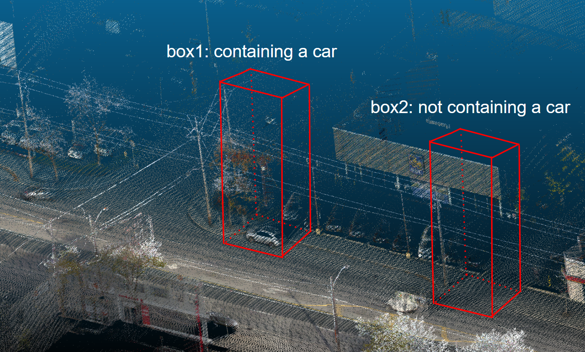
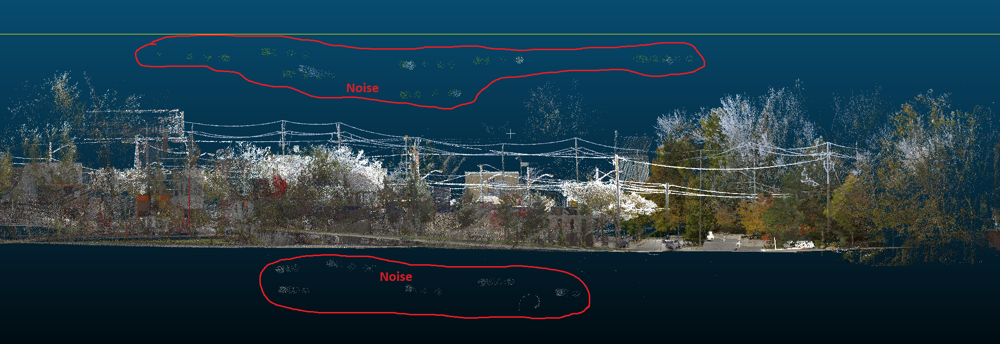

# 3D Object Classification and Segmentation
We did a lot of projects with 3D dataset. Most of them were related to `open3d`. Some of our tasks required 3D object classification and segmentation. Our default choice for these kind of projects were pointnet and pointnet++. 

## A demo project:
it's important to note that for NDA, I can not share actual project or actual project data. This is just a demo project similar to the original one with some random 3D objects from internet.

We did two kind of projects. 
1. Classification
2. Segmentation

*Getting a similar dataset is kind of impossible for this project. I found some dataset here: https://www.kaggle.com/datasets/priteshraj10/point-cloud-lidar-toronto-3d . This is not even close to our actual dataset. But this is all I have got without any license. The only similarities with this dataset and my project dataset is they are both 3d point cloud with outside environment.*

### Project 1: Classification
We were given some point clouds. Those point clouds were actually some chunks of a big point cloud scene. Our task was to find out if we have `object A` in that chunk or not. if we had `object A` in that point cloud, we considered that point cloud as our target point cloud. For this demo, Let's consider that if we have `car` in the chunk it will be considered as our target pointcloud. If there is no `car` in that pointcloud chunk, it won't be our target object.

Let's have a look at this image:

The outside 3D scene were first divided into many chunks. `box1` and `box2` are these kind of chunks. We were given many chunks with and without our target object. So, it was a standard supervised machine learning classification problem. Our task was to create a model that can determine if that 3D chunk has any car or not. `pointnet` classification model solves this problem very easily with very good accuracy.

*Note: some chunks had 4000 points some chunks had 8000 points, etc. before running this model we had to convert every chunks into a fixed number of points*

### Project 2: Segmentation
 We were given some pointclouds with heavy noises. Our task was to identify those noises and to remove them. For training images, Those noises were labeled. Say, non noise points were labeled as `0` and noise points were labeled as `1`. We had to make a segmentation model that can identify which points are noise and which are not. Similar to  classification case, this is also a standard supervised learning as we already know the label of the training dataset points. This is no unsupervised noise removal problem.

 Let's have a look at the image:
 
 
 As we can see it has some noises. These noises were labeled in training data. Our task was to create a model which can identify the noises in unknown test data. `Pointnet` segmentation model was a default choice to solve this problem.  
 *note: we were given big scenes. Pointnet can not handle such a big scene. So we had to make smaller scenes from a big scene. Segmentation was carried out on individual smaller scenes, and the results were subsequently combined to reconstruct the original-sized scene.*