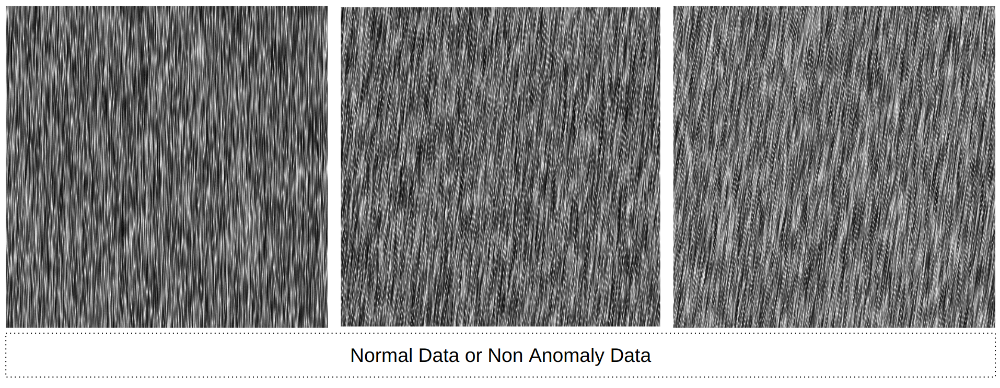
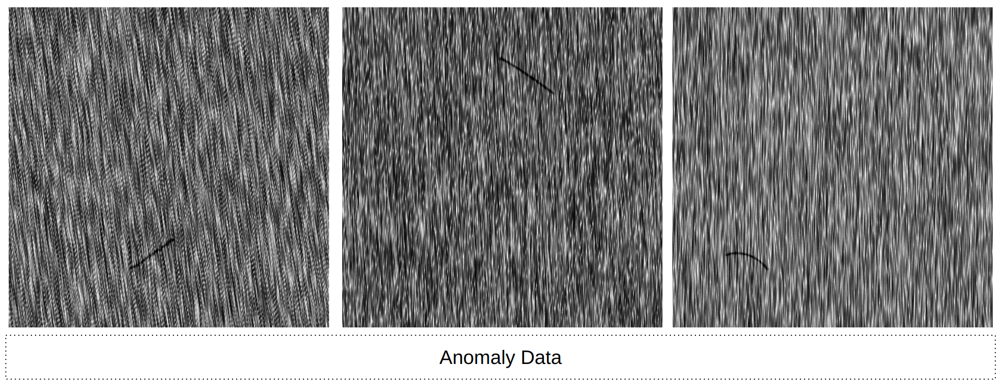
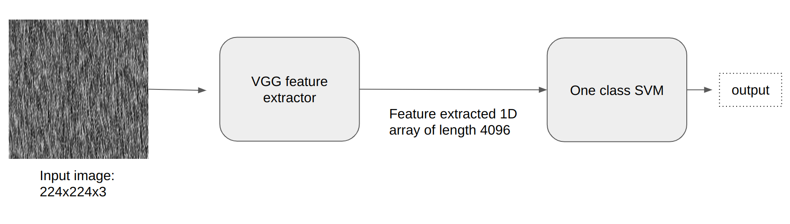
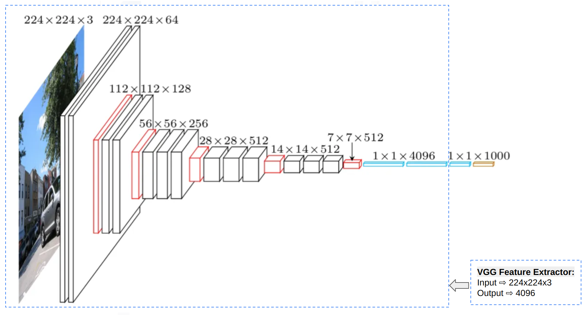
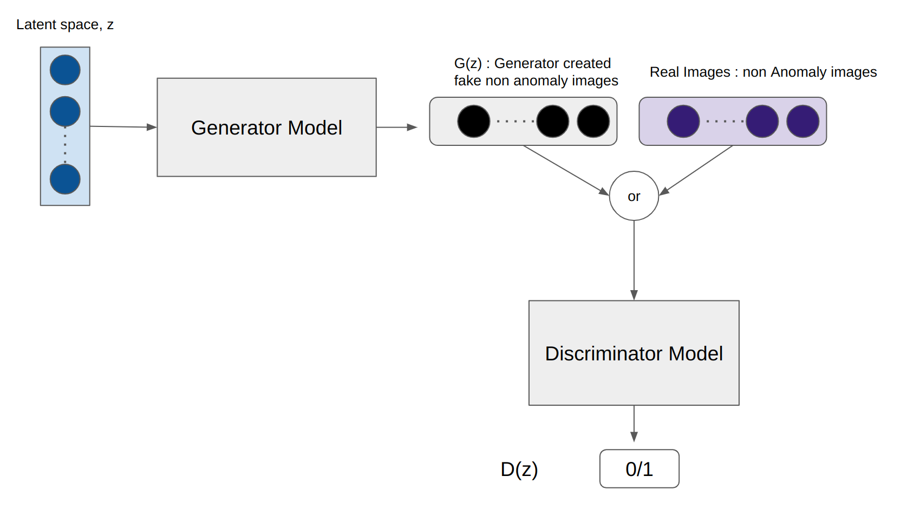
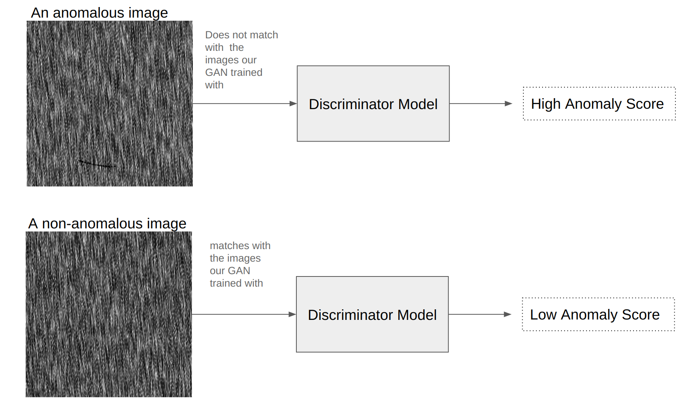

# Anomaly Detection
This was one of my first projects back in early 2019. I used two methods, one was `OneClassSVM` and another one was `AnoGAN`. Here I will explain how both of them worked.  
*It's important to note that after 2019 a lot of good models were released related to Anomaly detection. So the techniques used in this projects are kind of old.*

# Demo Project
For NDA, I can not share actual project or actual project data. This is just a demo project similar to the original one with some random images from internet.

### data
Let's consider this dataset. This is a demo dataset obviously. 
Non Anomaly data: 

Anomaly data: 

Anomaly data has some black spots or lines. We had to create a model that could detect an image with this kind of spot.

**This is not a classification problem.** In binary classification problem, ideally both the class should have similar number of examples. Obviously sometimes the case is not ideal, one class may have way more number of images than the other class. But even in those cases, both the class have minimum number of examples that can be used for training the  classification problem. 

Anomaly Detection dataset is different from the above mentioned dataset. Say we have 20000 normal (no anomaly) examples and 20 anomaly examples. So a classification model based on these two classes will be very biased and it will be very difficult to create. In these kind of scenarios, anomaly detection models come to the rescue. In anomaly detection models, A model is trained only based on non anomaly data. So number of non anomaly data does not matter that much.

### One Class SVM:
This is one of the way to create an anomaly detection model.  

- One class SVM model cannot handle big images. So we needed 1D array of any length as an example for one class SVM.
- Directly converting a 224x224x3 images into 1D array could a way. But by doing so, our data would lose all kind of spatial information. 
- A better way is using Feature extraction with a pretrained model. An easy way of doing this is using VGG16. 
- If we remove the last layer (output layer) of VGG16, we can consider rest of the network as a feature extractor.
- so, if we pass a 224x224x3 size image as an input of the model, our output will be a 1D vector of length 4096. Which is an ideal data set structure to train a one class SVM model.

Explanation of the image:
- The whole structure is VGG16 and the structure inside the blue dotted line indicates the feature extractor. 
- the input of the feature extractor is a `224x224x3` image and the output is converted into a 1D array of `4096` length.

### AnoGAN
- AnoGAN is a type of GAN (generative adversarial network) designed for unsupervised anomaly detection. It's very important to note that it is trained on normal/non-anomaly data only. That means our model never sees an anomaly data during training.
- Like traditional GAN, it consists of two neural networks - a generator and a discriminator. The generator tries to synthesize fake data similar to the training data (non Anomaly data), while the discriminator tries to distinguish between real and fake data.
- During training, the generator and discriminator play a min-max game. The generator tries to minimize the discriminator's ability to tell apart real and fake data. This encourages the generator to produce more realistic synthesized data over time.
- When the AnoGAN is fully trained:
    - Generator is capable of creating realistic fake non anomaly data
    - And Discriminator is capable to distinguish between a fake image ( generator created non anomaly image) and a real image ( an actual non anomaly image)

- AnoGAN structure: 

AnoGAN structure is actually similar to any other traditional GAN structure. 

**How to use AnoGAN to determine anomaly?**
- From AnoGAN we actually need only the Discriminator Model. Generator model has no use for the inference.
- Our AnoGAN discriminator can detect if a non anomaly image is created by the generator or it is a real non anomaly image. 
- Once AnoGAN is trained, we can use the trained discriminator to compute an "anomaly score" for new test images. The anomaly score represents how anomalous or outlying the test image is compared to the distribution of normal images learned by the generator.
- During training, the discriminator is tuned to give `high scores` to fake images produced by the generator, and `low scores` to real training images. This means the discriminator learned to recognize what "normal" image looks like based on the training data, and anything that deviates from that will get a higher anomaly score.
-  Now, if a test image is fed to the discriminator:
    - if it's a non anomaly image: it will look like a `real image` to the discriminator, so the anomaly score will be lower.
    - if it's an anomaly/outlier image: it will not match with the images that were used to trained the GAN model. So, this image will look like `fake image` to the discriminator. Hence, the anomaly score will be higher for these kind of images.

- So the fundamental intuition is that the discriminator's anomaly scores allow us to detect which images stray away from the generator's learned representation of normality. Images dissimilar to normal training data get higher scores and hence, they are considered as anomalous examples.

#### Which one worked better for our dataset? One Class SVM or AnoGAN?
Surprisingly for us, One class SVM worked slightly better than AnoGAN. Our Feature extraction + one class SVM model was very strong. But AnoGAN did not perform up to the mark. Though theoretically AnoGAN should work just fine, but when we applied it on our complicated practical dataset, it just did not perform how we expected. So we continued our task with feature extraction and one class SVM model.

