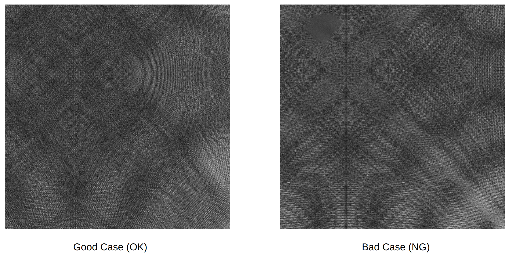
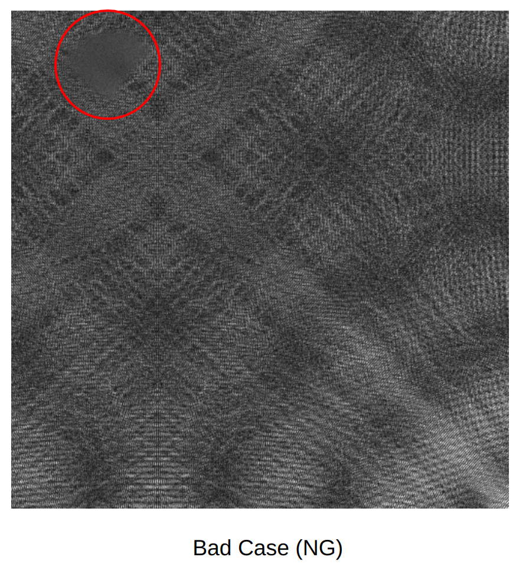
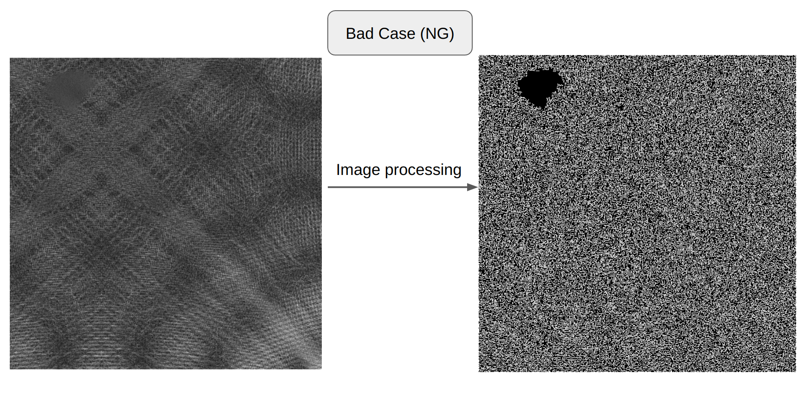
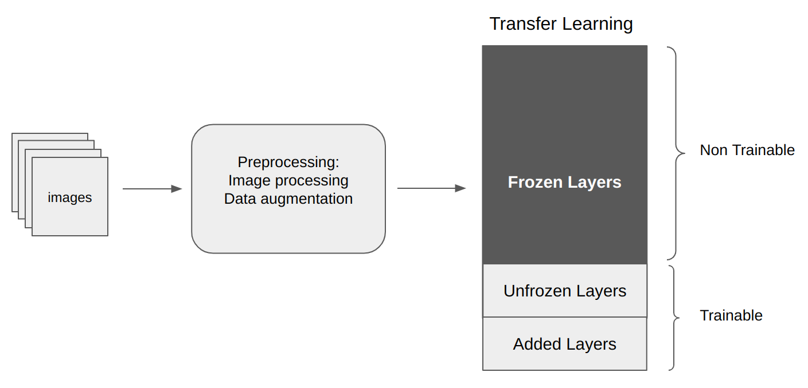
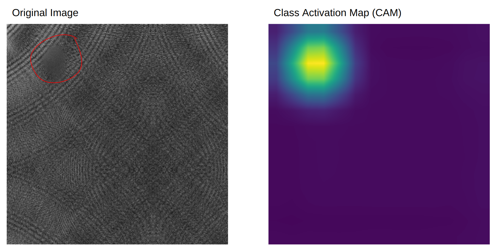
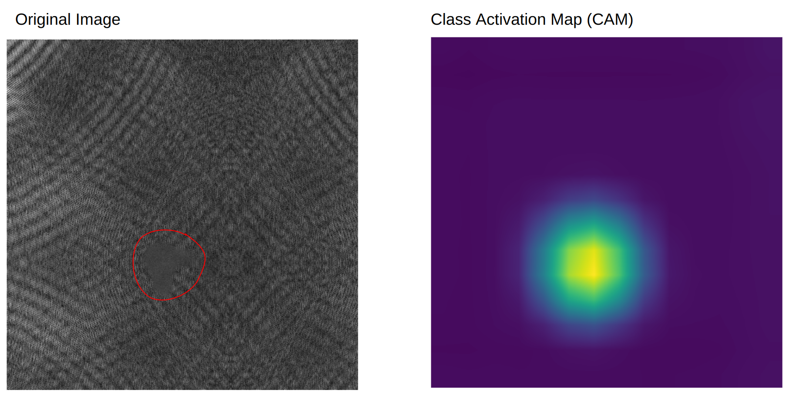
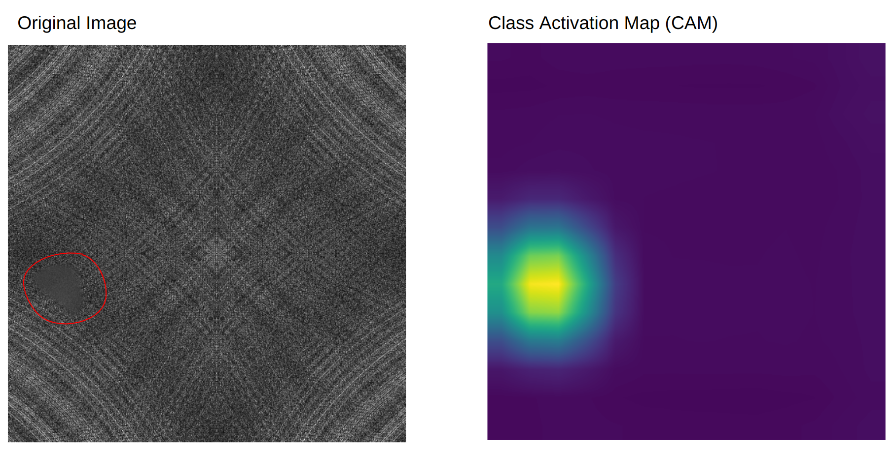

# Classification and Class Activation Mapping (CAM)
We did a lot of image classification projects. Mainly the target objects were industry items. We solved both binary classification and multi-class classification problems. But most of our classification tasks were binary classification with these two classes:
1.  Good condition objects (OK) and
2.  Not Good condition objects (NG). 
Here I will show a similar demo project about binary image classification.

## A Demo Project
*It is crucial to emphasize that due to the non-disclosure agreement (NDA), I am unable to disclose the actual project or its data. The presented project is merely a demonstration, resembling the original one but featuring random images sourced from the internet*

#### introduction
We were given 2 types of images. Some of them were good images (OK) and some of them were bad images (NG). We had to identify which one is which. Let's have a look at 2 images from our demo dataset:

There is a spot in the bad case. But as you can see, the spot is not very distinguishable. To make it clear I am making a red circle around the bad case point.

Most of our datasets were like this or even harder to find out the bad spot. Our classification model had to face two problems:

1. A bad case spot was very undistinguishable in many cases. 
2. The number of good case examples was too high compared to the number of bad case examples.

We solved these two problems. And I will explain them here also.

#### Data preparation:
##### Handling data imbalance
For most of the cases, we had a huge class imbalance. There were lots of good cases and less number of Bad cases. So we had to do a lot of data augmentation. 
- The common augmentation that we used were: horizontal flipping, vertical flipping, rotation, translation, cropping, color jittering ( brightness, contrast), deformation, etc.
- We augmented both good cases and bad cases. We took samples from good cases and bad cases. Say we took 500 samples from augmented good cases and 500 samples from augmented bad cases. So now there is no data imbalance.
- Sometimes number of bad cases is too low and augmentation is not a viable option. In those cases, we had to change the `loss function`. we had to put more weight on the minority class to give it more importance.

##### Image processing
Another data preparation step was Image processing. As I mentioned earlier, most of our NG dataset's spots were indistinguishable. In some cases, it was very difficult to identify at the first glance. In those cases, after doing some image processing, the spot became very distinguishable. Let's have a look at the result of some image processing:

Good Case:

Bad Case:

From the above two images, it's very clear that after image processing, The spot is very distinguishable now. 
For most of the cases, this type of image processing actually helped us a lot with image classification problems. 
**You will find some of my image processing tasks here in the[Image_Processing folder](../Image_Processing/)**.

#### Training
- Most of the time we used `transfer learning` for training purposes. We used `vgg`, `resnet`, `mobilenet`, `inception`, `xception`, etc models. 
- However, industry data were very different than the `imagenet` dataset. So we had to `unfreeze` some of the last layers to let the model be trained. How many layers are to be unfrozen or how many layers are to be added actually depends heavily on the dataset.
- if the dataset is similar to `imagenet` a few unfrozen layers are okay. But if the dataset is very different than `imagenet`, the number of unfrozen layers must be increased. 

This is a simple training dataflow:

- Depending on the dataset, Our accuracy varied a lot. For this particular dataset accuracy varies around `99%`. The reason is very simple. After image processing, it is a very easy dataset. 
- However, In a lot of cases, Accuracy was not our main goal. `F1-score`, `recall`, `precision`, etc were even more important than accuracy depending on the dataset. 

#### Inference
The inference of this project is very straightforward. Just we had to keep in mind one thing: *what was our preprocessing?*. If we do the same preprocessing that we did in training, the inference is good to go. 

## Class Activation Map (CAM)
Sometimes only finding the bad spot image was not enough. We were asked to find where the spot was in the image. In other words, we want to know for which region our model is considering the example as a bad case one.
Let's have a look at the images:

For all three images:
- The left side means the original image. **In the original dataset (or in the training or testing data) obviously there is no red boundary around the spot. I have used them just to make it easier for the readers to find the bad spot**
The right side indicates the Class Activation Map for the left side image. The bright yellow area indicates the region for which our model is considering the original image as a bad example (NG).
