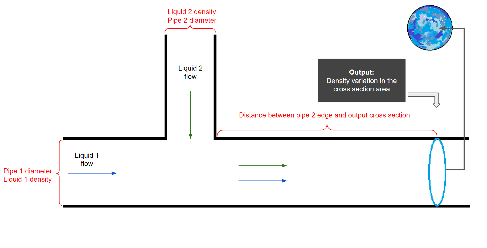

# Conditional GAN
We created a project where we had to predict the density of the liquid inside a pipe crossection using Conditional GAN (cGAN). I am showing a demo project related to this problem.

## A demo project:
it's important to note that for NDA, I can not share actual project or actual project data. This is just a demo project similar to the original one with some randomly created images.

#### introduction
we were given a strange array of input data. Before discussing anything, let's have a look at the input data and the output data.

