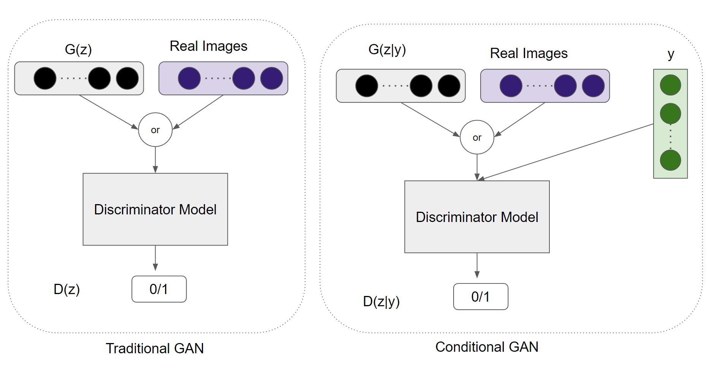
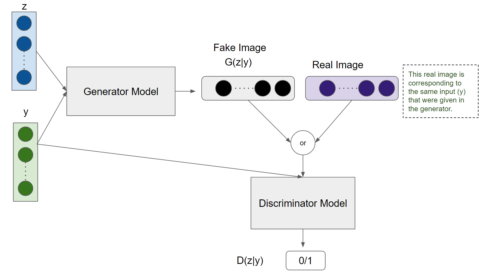

# Conditional GAN
We created a project where we had to predict the density of the liquid inside a pipe cross section using Conditional GAN (cGAN). I am showing a demo project related to this problem.

## A demo project:
it's important to note that for NDA, I can not share actual project or actual project data. This is just a demo project similar to the original one with some randomly created images.

#### introduction
we were given a strange array of input data. Before discussing anything, let's have a look at the input data and the output data.

##### Explanation of the inputs and the output:
**inputs:**
- `diameter of pipe 1`: it's the diameter of the first pipe. The output has the same diameter also. You can see it from the image.
- `diameter of pipe 2`: it's thinner compared to pipe 1. 
*it's also worth mentioning that two different liquid were flowing through pipe 1 and pipe 2. And their density were also different.*
- `density of liquid 1`
- `density of liquid 2`
- `distance between the edge of the pipe 2 and output cross section` 
So, number of input argument here is 5.

**output:** 
`density variation in the cross section area`: 
depending on the 5 inputs, the cross section area had different densities at different spots. 

In the above picture I used shades of blues to indicate different densities. Our target was to predict this density variations inside the pipe at a particular cross section.

### Conditional GAN model
Similar to every GAN model, it has a discriminator and a generator. Generator's task is to create a real looking Output ( density variations ) provided that it already knows the inputs. Discriminator's task to find out if generator's output is real or fake provided that it already knows the inputs. Like all GANs they have an adversarial relationship. When the generator is in an initial state and can not work properly, the discriminator is too powerful. When the generator becomes powerful and can generate almost real looking outputs ( density variations at the cross section), the discriminator gets confused. The models are trained together in a zero-sum or adversarial manner, such that improvements in the discriminator come at the cost of a reduced capability of the generator, and vice versa.

#### Generator
Let's have a look at a traditional GAN generator and a conditional GAN generator.

**For Traditional GAN generator** 
`z` is the latent space. 
`G(z)` is the output of the generator. As the output here is an image, G(z) will be an image, say a 512x512 sized image.

**For Conditional GAN generator** 
`z`: latent space. 
`y`: it is the input parameters. In our case `y` has 5 dimensional array as there are 5 inputs. Inclusion of `y` in the generator makes it different than traditional GAN generator.  
`G(z|y)`: Generator output provided that `y` is given.

**Difference between Traditional GAN generator and Conditional GAN generator:** 
Consider MNIST dataset as a simple example. With Traditional GAN generator, it will randomly create an MNIST data. It can be a 0,1,2,3..... etc. You can never guess what number the output will be.

Even, if the model is not that good, it may also create a random 28x28 sized image that won't be either of the numbers. 

However, if we use conditional GAN, we can actually choose which number we want to create. We don't have any access to `z` value, but we can control `y` value. We can choose which `y` value we want in our output.

Like MNIST our model works in a similar pattern. If we choose a specific input our generator will try to create density variation only for that specific input variables, not just a random output. It will create a believable output for that specific input values. 

<!-- **Training the generator** 
We had a dataset where we knew the output (*density variations in the cross section area*) for 5 input variables ( *diameter of pipe 1, diameter of pipe 2,density of liquid 2,distance between the edge of the pipe 2 and output cross section* ). Say we had around 500 similar input-output set. So, training the generator is very straight forward:
- as `y` we gave a specific input
- as `z` we gave some random values ( latent space )
- as `G(z|y)` we compared the output with the specific input that was given. -->

#### Discriminator

**Traditional GAN discriminator:** 
Sometimes it will get `G(z)` (generator output or fake images) and sometimes it will get Real Images. Discriminator's output is very simple, just 0/1. It will be trained so that it can identify real images and fake images ( generator's output). 

**Conditional GAN discriminator:** 
Like traditional GAN it also takes generator's output and real images. But it also takes input variables.

`y`: a specific input variable
`G(z|y):` generator's output ( fake image ) for that specific input variable `y`.
`Real Images: ` Real image for that specific input variable `y`.

The discriminator is trained so that *when an input is specified, the discriminator can detect which one is fake image (generator's output) and which one is real image for that specific input*. 
it's very important to note that both fake image (generator's output) and real image correspond to same input values.

#### The Whole GAN model

Let's have a look at a step by step manner:
1. First, some random numbers from latent space `z` and a specific input `y` are fed to the generator.
2. Generator creates a fake image `G(z|y)` based on the specific input `y`.
3. Fake image `G(z|y)` or a Real Image are fed to the discriminator. Both the real image and fake image `G(z|y)` correspond to the same input variable `y`. Discriminator tries to detect if it is a fake image or a real image given that the input `y` is known.
4. The generator and the discriminator both are being trained simultaneously. For a specific input, generator is being trained to be more real-like so that it can deceive the discriminator and the discriminator is being trained to identify if it's real or fake. This adversarial relationship makes the discriminator and the generator stronger. 

<!-- #### Why using while conditional GAN instead of a traditional Deep Learning model? -->
