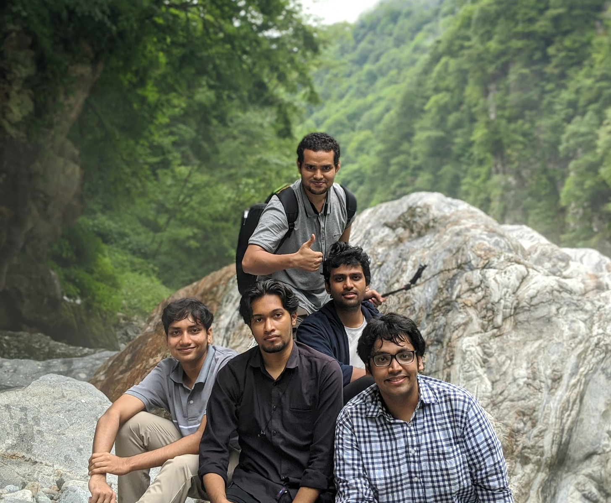

# Face Recognition
We created a program to recognize known faces from images ( and videos ) and also it could identify faces that are not in the dataset. I will show you a demo project about this face recognition techniques.

## A demo project
it's important to note that for NDA, I can not share actual project or actual project data. This is just a demo project similar to the original one with some random images of me and my friends.

#### introduction
Say we have to create a program that can recognize 4 people. The names of those 4 people are `ali`, `shaan`, `tamim`, `amit`. I am using the names as labels here. Our program will be able to do one more very important thing:
 **it will identify all other persons as `unknown`**. 

 #### face data preparation
 - Instead of taking photos, we used face videos. So we got a lot of Frames.
 - Each person was instructed to look up down left right and straight into the camera while filming the video.
 - So, Each person has all sided face photos in our dataset.
 - It was made sure that when capturing the videos, only that person's face was in the camera - no other faces.
 - Some frames extracted from the video had to be removed because the face was too much into the non-frontal portion(for example: extremely rightwards or leftwards facing face)

 Here are some example of photos that were collected from the videos:
 
 
 From the above image it's certain that, each person has to look at different direction while filming himself/herself.

 #### Face Encodings
 This is one of the most important steps of the project. We must first quantify the faces in our training set before we can recognize faces in images and videos. We didn't actually train a network here — the network had been trained to create 128-d embedding on a ~3 million image dataset. We are just using this to get features from each image that has 128 dimensions. So this step actually just feature extraction.
 
- step 1: it was the original image. it must have a clear face image in it.
- step 2: we detected the face portion in the original image.
- step 3: creating a 128-D feature vector from the face part.

So, every images from every person was converted into 128-D feature vectors. In other words, our ML model's input was 128-D feature vector, not the image itself.

#### ML data preparation
Have a look at this data preparation image:

- Each and every face was converted into a 128-D face encoding.
- if we have N number of images in train dataset, then shape of X is `Nx128`. and shape of Y is `Nx1`. However if Y is one hot encoded in that case shape of Y is Nx5. Because there are 5 classes: `ali`, `shaan`, `tamim`, `amit`,`unknown`.

##### How to create `unknown` class dataset?
This part is tricky. If we don't use any unknown class. Every faces would be either `ali` or `shaan` or `tamim` or `amit`. So, we had to introduce and `unknown` class.

We collected lot's of random faces of random people and called them `unknown`. It's better to use diversity while choosing faces for `unknown` class. There are lot's of online dataset where you will get random faces of thousands of people. It's better to use such a dataset for your `unknown` class.

#### Training:
- We converted all the faces into 128-D face encodings.
- We labeled all the encodings as either `ali` or `shaan` or `tamim` or `amit` or `unknown`
- So we have 128-D input dataset with 5 classes. This is Now a classic Machine Learning problem.
- We tried SVM, Random Forest, KNN etc. For our case it seemed that `SVM` worked best.

#### inference:
Say This is our inference photo. We have to label faces from this photo.

1. At first our program will detect all the faces in the image. These are all the detected faces:

The white rectangle around the face indicates the area which is actually detected as face area.

2. These face areas are then extracted to become 128-D face encodings. So all the 5 faces are now 5 128-D face encodings. 
3. These 5 encodings are fed into the pre trained facial recognition model (SVM). Our model will decide which encoding is related to which label.

4. This is the final result:

#### video inference:
We also did the inference for videos. This is pretty straight forward. We had to split the frames from the video and then did the above mentioned process on each frame and lastly merged all the frames to make the video again.

    

