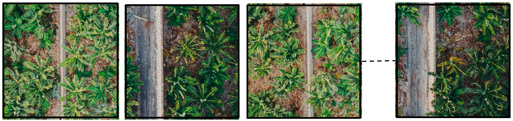
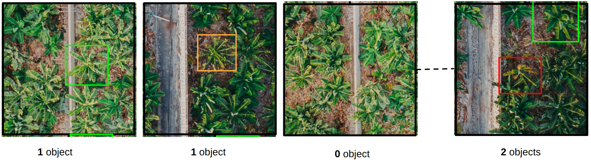
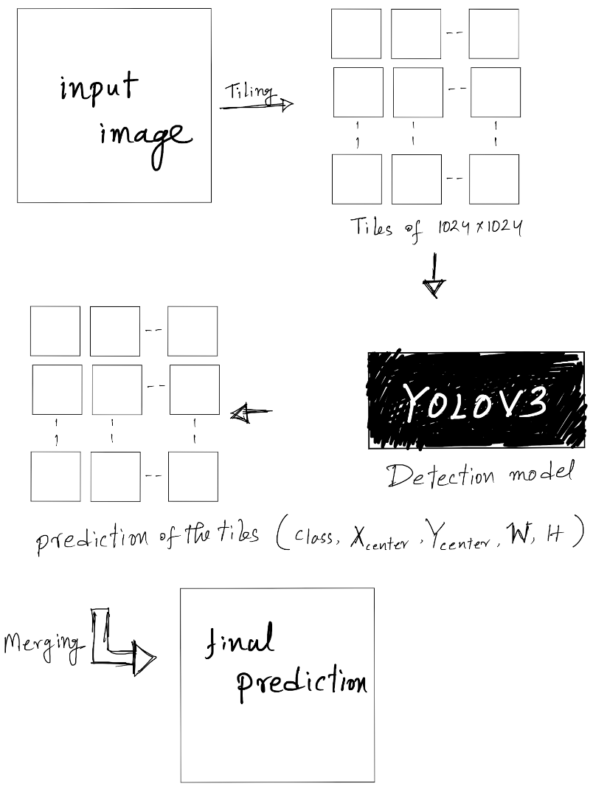

# Image Detection
Similar to image segmentation, we did a lot of projects related to image detections. As a member of the AI research team, I was a part of those projects. For some cases, I did a portion of the projects, for some cases I did the whole thing. Here, I will show you a demo project about image Detection.

## A demo Project

it's important to note that for NDA, I can not share actual project or actual project data. This is just a demo project similar to the original one with some random images from the internet.

#### introduction
Say, we were given some big ortho images or big drone images. Those images contained Banana fields and some other parts. Our target object is banana tree. So every other thing was just background. Banana tree had 3 classes: `class_1`,`class_2`,`class_3`. 
- `class_1` means a little yellowish green tree. Nothing to worry about.
- `class_2` means the tree is already very yellow. Measures should be taken.
- `class_3` means the tree is dying. The color is yellow to brown. We need to get rid of it. 

**most of the trees were completely green. They were not our target object. So they were also considered as background**

The ultimate target of that project was to find out which banana tree should be investigated and getting an overall idea over a huge amount of land.

#### Input dataset and annotation:
We were given big ortho images ( or big drone JPEG images in some cases ). The demo images and annotation of the images were like this.
Say, this is the input image:


- This is an aerial image
- The image is in 90 degree angle

First we did the annotation. We identified the banana trees from above mentioned classes. If it did not belong to those classes it was considered as the Background.

in this demo case: green box indicates class_1, orange box indicates class_2 and red box indicates class_3.

#### Processing:
For annotation purpose, it was easy to use drone images or ortho images. But to train the model we needed to convert both the image and the annotation into a reasonable size. Say, We chose 1024x1024. These tiles ( images and the annotations) were fed to train the detection model. Here you can see the tiles in black boxes.


For every tile we had to create a annotation txt file. Say in a tile there are two of our target object. In that case the txt file related to the image will have 2 lines. It will be something like this:
```
2 235 512 80 200
0 400 335 100 120
```
**Explanations:**
- `2 235 512 80 200`: 
    - `2` indicates the class. `2` means it's from class_3 (very bad)
    - `235` means X_center of the bounding box
    - `512` means Y_center of the bounding box
    - `80` means W of the bounding box
    - `200` height of the bounding box
- `0 400 335 100 120`:
    - `0` indicates the class. `0` means it's from class_1 (nothing to worry)
    - `400` means X_center of the bounding box
    - `335` means Y_center of the bounding box
    - `100` means W of the bounding box
    - `120` height of the bounding box

If a tile has only one target object it will have only one line in the related txt file. If it has no target object, the related txt file will be empty.

We set up the dataset like this:
```
custom_dataset/
├── data/
│   ├── obj.names
│   ├── obj.data
├── cfg/
│   ├── yolov3.cfg
├── train.txt
├── valid.txt
└── images/
    ├── image1.jpg
    ├── image2.jpg
    └── ...
```
- obj.names: A text file containing one class name per line (e.g., "cat," "dog," "car").
- obj.data: A configuration file containing dataset information, including the paths to obj.names, train.txt, valid.txt, and the number of classes.
- yolov3.cfg: The YOLOv3 configuration file you'll modify (more on this below).
- train.txt and valid.txt: Text files listing the paths to your training and validation images (one path per line).
- images/: A folder containing your labeled training images.

We also had to modify our config file (`cfg/yolov3.cfg` file) to meet the criteria of our dataset. We used pretrained model from darknet repository. Training a huge yolov3 model from the scratch was not a viable option for us. Because we had a limited number of dataset and as always it would have take a lot of time to train a yolov3 from the scratch.

#### Training
Training a yolov3 model is actually pretty straight forward. As we used darknet repo, they have specific command line info to run a yolov3 model.
the command is something like this:
```
./darknet detector train data/obj.data cfg/yolov3.cfg darknet53.conv.74
```

#### Inference
This part is tricky actually. As we can not use the a big image for training same goes for inference. Say a drone image is 5000x4000 pixels. It's not possible to use this whole image. So we had to cut the images into tiles, and then merge the tiles to rebuild the full prediction of the image.

Consider it as a test image of bigger size. So we have to make tiles to use it with the model:


The tiles from the test image:


The output from the model for each tiles:


This is not actually true. We actually got `class,X_center,Y_center,W,H`` values for every object from an input tile. This above image is actually a visualization of the whole tiling prediction.

This is the inference summary:



#### If geo information is available in the test photo
In test images, if we have orthophoto with geo information, we could do the prediction with the geo information after merging the tiles. We could then see exact location of the dataset and the prediction in the map with appropriate applications. So our customer could go to those specific map locations to handle the issues with the banana trees.