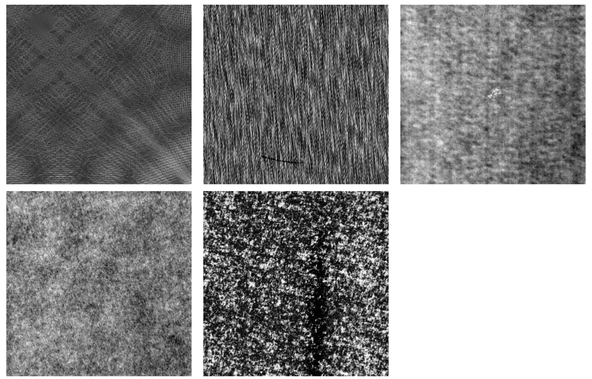
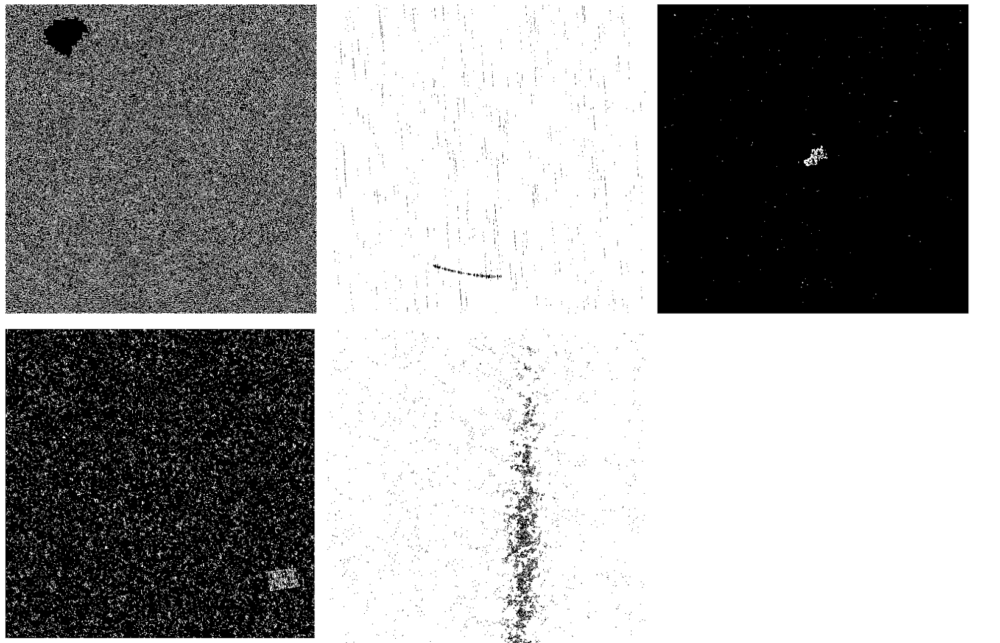
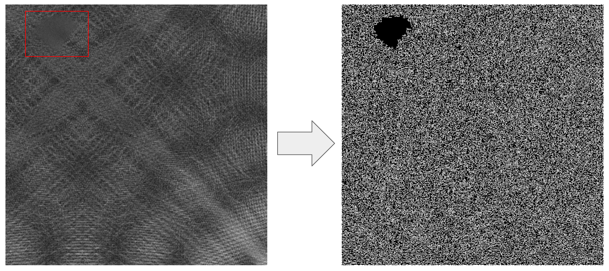
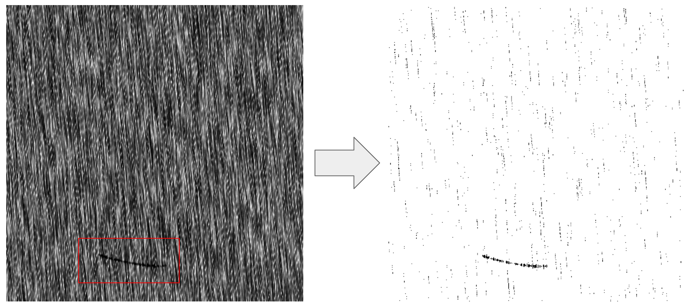
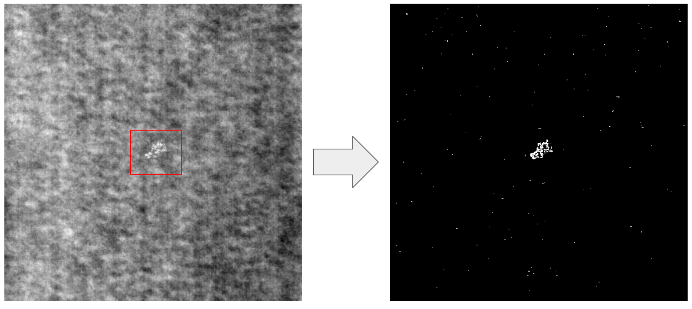
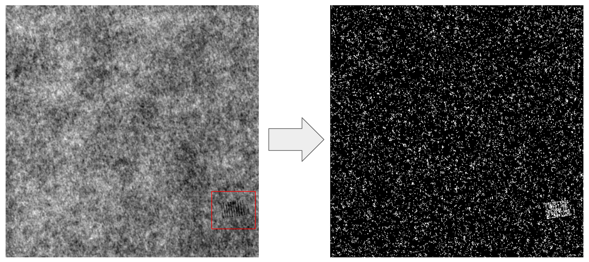
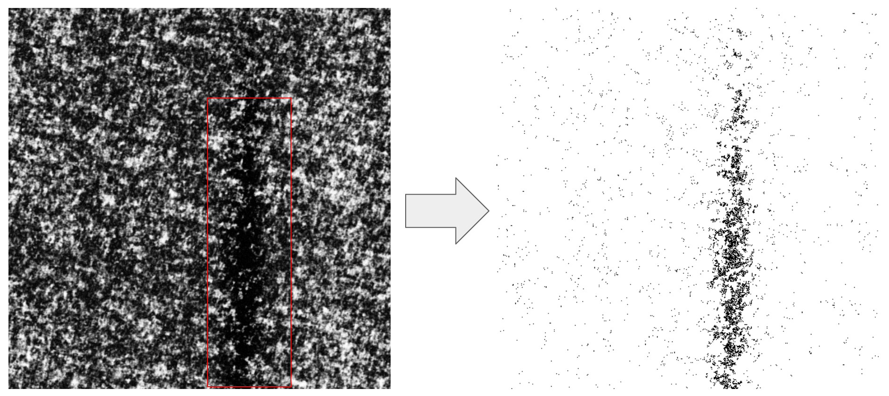

# Image Processing
I was given some images where there were some spots. But the problem was the spots were very non noticeable in the first glance. My task was to make some image processing so that the spot area becomes very clear in the first glance. 
*For obvious reason, I can not show the original dataset that I used for the company. I am using a similar public dataset from internet*

**some sample images with less clear spots:**

 
I did some heavy image processing on these images to reveal the spot area.
After doing some image processing, The corresponding images became like this: 
**same images with more clear spot area:**

Techniques I have used are listed below:
- canny edge
- blending two images (addWeighted)
- thresholding
- different kind of morphological transformations

**Let's have a look at the input and output of the image processing with more details:**

### why was it important?
I used these image processing for Classification task also. With small CNN, initial classification accuracy was not that higher, around 80-85%. But after doing the image processing the accuracy became around 95-98% with the same small size CNN. 