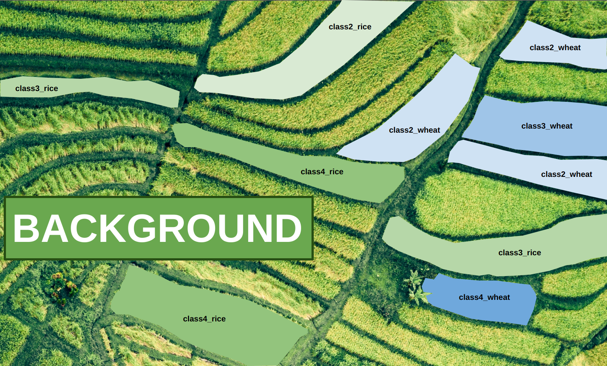
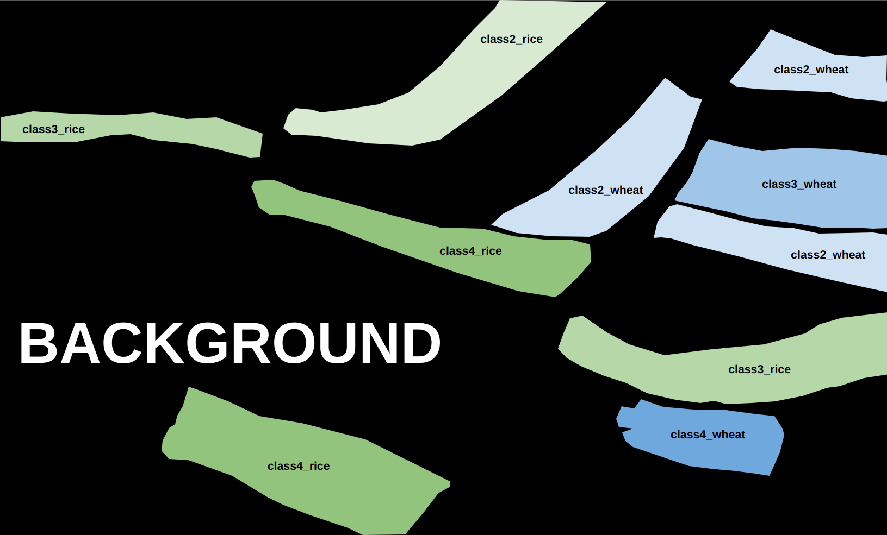
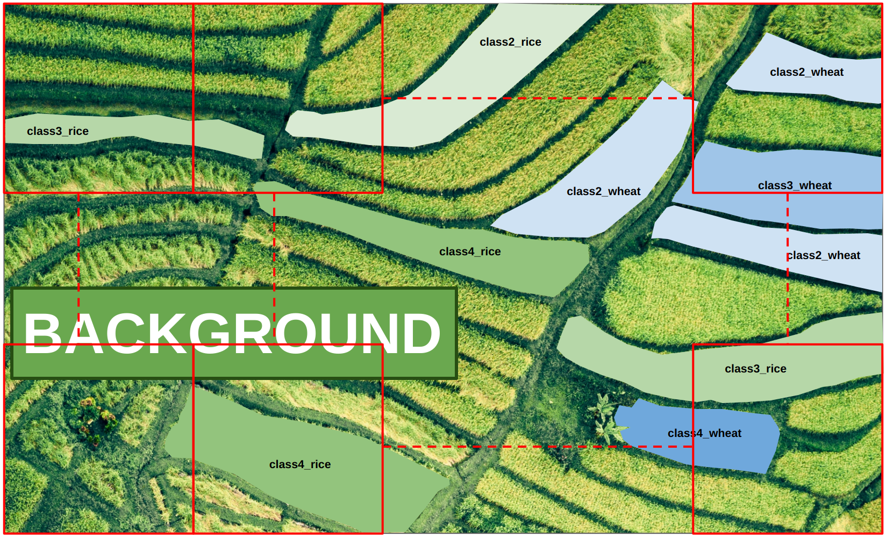
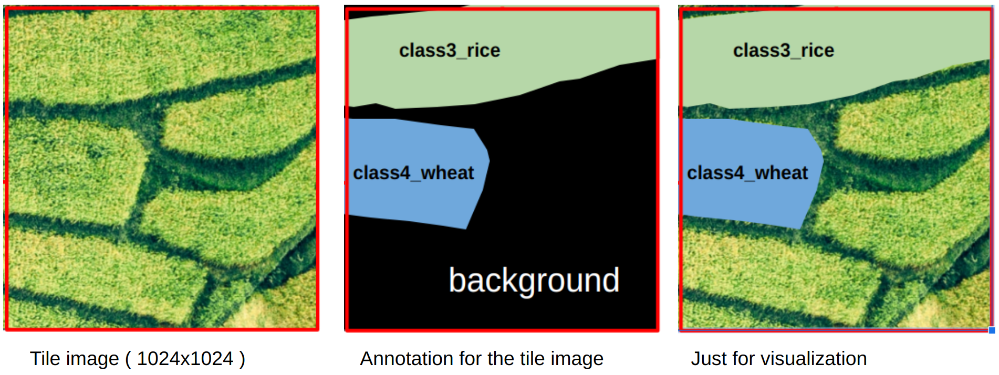
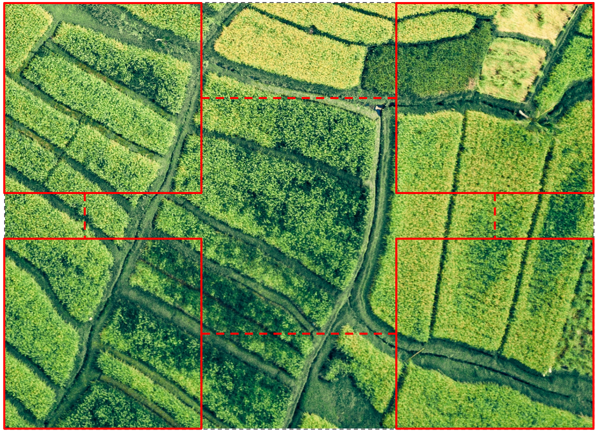
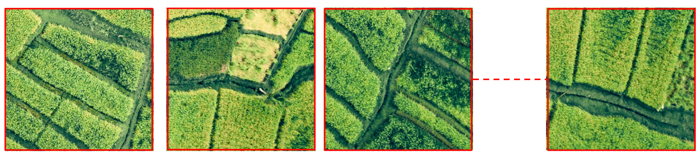
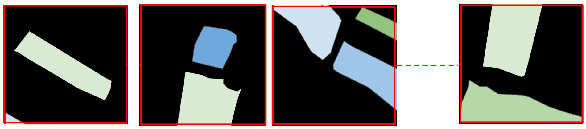
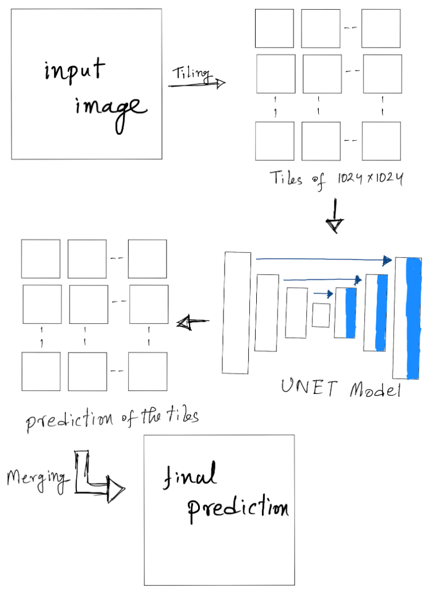

# image segmentation

we did a lot of projects regarding image segmentation. As a member of the AI research team I was part of those projects. For some cases, I did a part of the projects, for some cases I did the whole thing. Here, I will show you a demo project about segmentation. 

## A Demo Project
it's important to note that for NDA, I can not share actual project or actual project data. This is just a demo project similar to the original one with some random images from the internet.

#### introduction

Say, we were given some big ortho images. Those images contained rice fields or wheat fields and some other crop fields. Our target object was rice and wheat. Rice fields had 5 classes: class1_rice, class2_rice, class3_rice, class4_rice, class5_rice. Same as rice, wheat fields had 5 classes: class1_wheat, class2_wheat, class3_wheat, class4_wheat, class5_wheat. Every other things were considered as background.

so all the classes are: `class1_rice, class2_rice, class3_rice, class4_rice, class5_rice, class1_wheat, class2_wheat, class3_wheat, class4_wheat, class5_wheat, background`

*class 1 means just planted, class 5 means ready to harvest. The rest of the classes are in between serially.*

The ultimate target of that project was to find out which field was from which class and getting an overall idea over a huge amount of land.

#### input dataset and annotation
We were given big ortho images ( or big drone JPEG images in some cases ). The demo images and annotation of the images were like this.

Say, this is an input image:

- This is an aerial image
- The image is in 90 degree angle

First we will do the annotation. We will identify the crop segments in above mentioned classes. If it does not belong to rice or wheat classes it will be considered as the Background.

Now, Let's have a look at the final annotation:

For annotation we used: `LabelImg`, `VGG Image Annotator`, `segments.ai` etc.

#### Processing:
Obviously we can not use a Huge size ortho images directly for training. We had to do some basic processing. we had to make tiles of 1024x1024 from ortho images and the annotations. These tiles were used as the input of the segmentation models. 

In actual project the tiles were overlapping. For visual purpose we ignored overlapping here.
Let's have a look at a demo tile of 1024x1024 size:

#### Training
For training, we used libraries like segmentation_models and Amazing_Semantic_Segmentation and also UNET from scratch. For our case segmentation_models worked best. It is very easy to use and very easy to change different parameters and backbone models. We tried different backbones like: `resnet50`, `resnext101`, `inceptionv3`, `inceptionresnetv2`, `efficientnetb7` etc. For our particular case `inceptionv3` worked best.

For augmentation we used `albumentations`. We had to also create a custom dataset class to handle the dataset.

#### Inference
This part is tricky actually. As we can not use the a big image for training same goes for inference. Say a drone image is 5000x4000 pixels. It's not possible to use this whole image. So we had to cut the images into tiles, and then merge the tiles to rebuild the full prediction of the image. 

Consider it as an output image of bigger size. So we have to make tiles to use it with the model.

The tiles from the output image:

The output from the model for each tiles:

While getting these predictions we kept track of the boundary points (x1,y1,x2,y2) for each tiles. So, for the next step we just merged the tile predictions.

This is the inference summary:

#### if geo information is available in the test photo
In test images, if we have orthophoto with geo information, we could do the prediction with the geo information after merging the tiles. We could then see exact location of the dataset and the prediction in the map with appropriate applications.