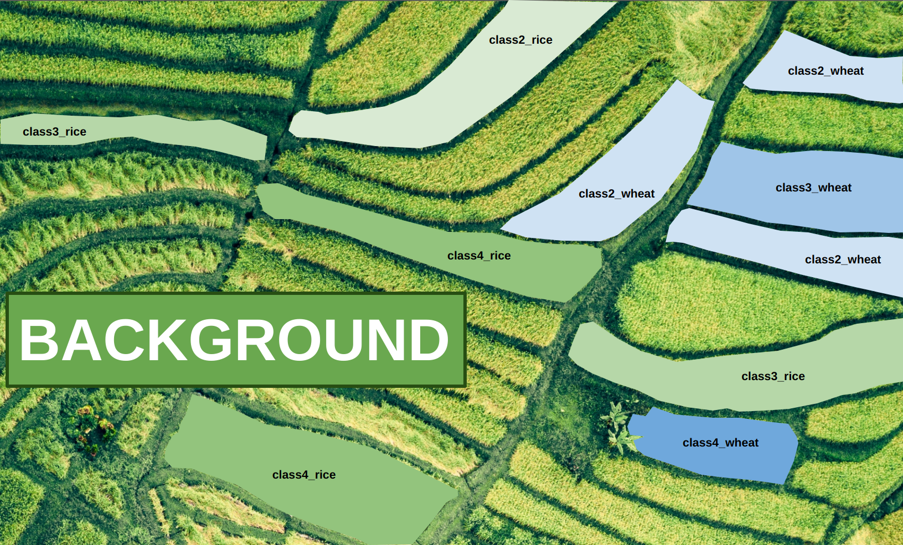
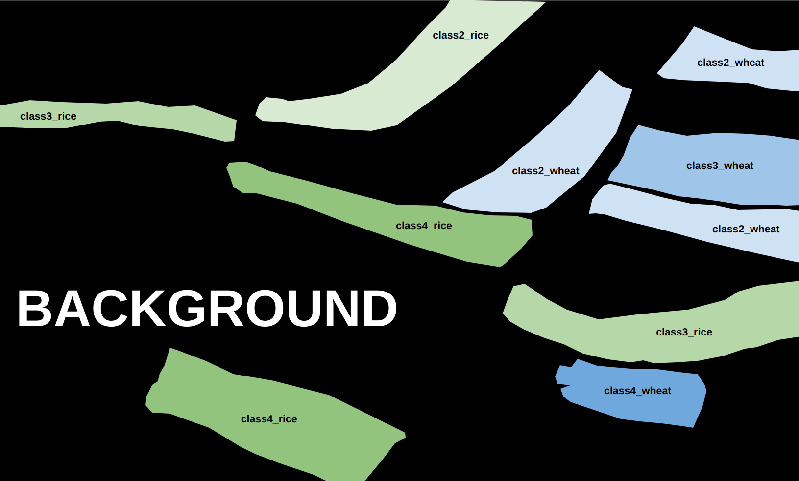
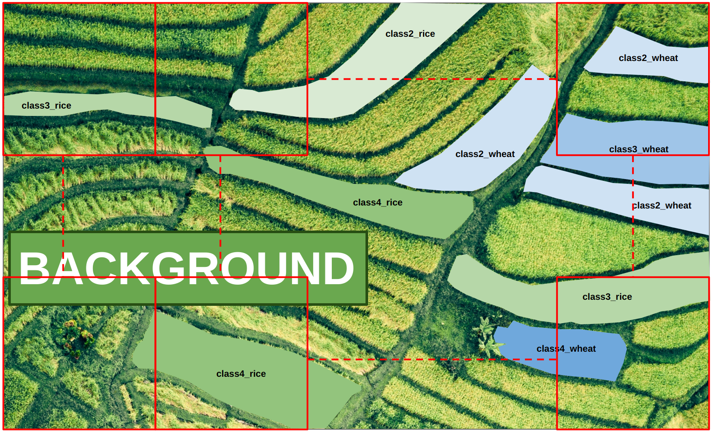
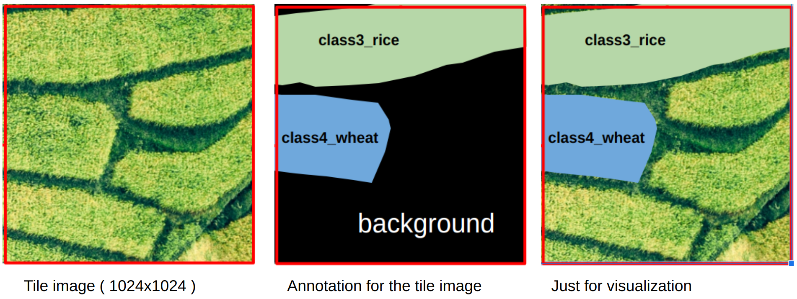
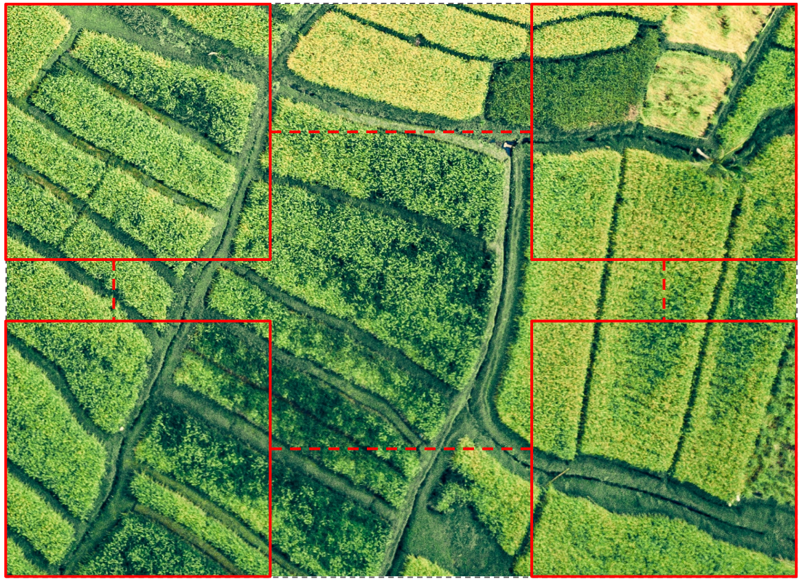
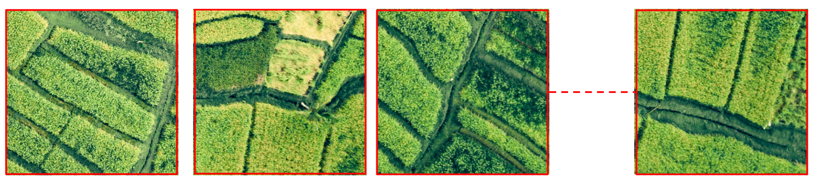
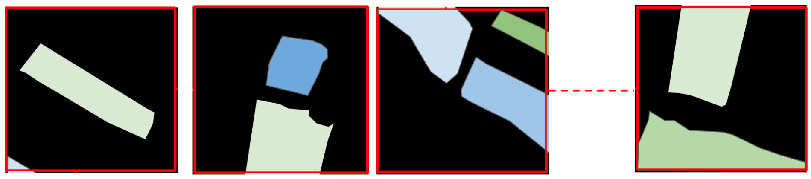
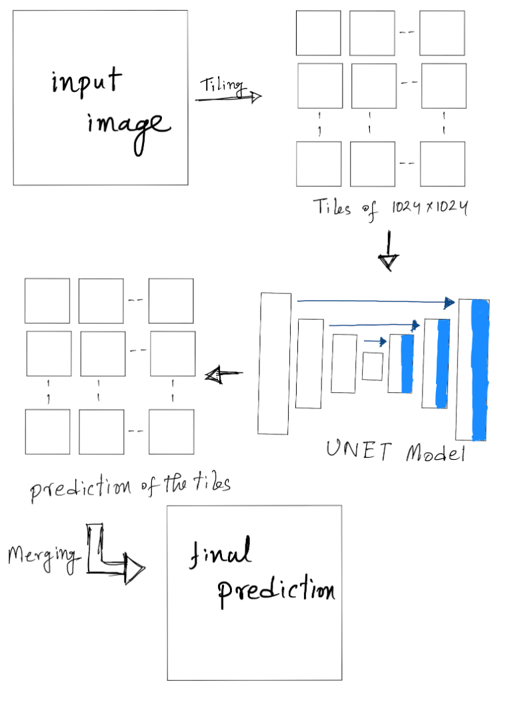

# image segmentation

we did a lot of projects regarding image segmentation. As a member of the AI research team, I was part of those projects. In some cases, I did a portion of the projects, and in some other cases, I did the whole thing. Here, I will show you a demo project about image segmentation. 

## A Demo Project
*It is crucial to emphasize that due to the non-disclosure agreement (NDA), I am unable to disclose the actual project or its data. The presented project is merely a demonstration, resembling the original one but featuring random images sourced from the internet.*

#### introduction

Say, we were given some big ortho images (or big drone images). Those images contained rice fields or wheat fields and some other crop fields. Our target object was rice and wheat. Rice fields had 5 classes: class1_rice, class2_rice, class3_rice, class4_rice, class5_rice. Same as rice, wheat fields had 5 classes: class1_wheat, class2_wheat, class3_wheat, class4_wheat, and class5_wheat. Every other thing was considered as background.

so all the classes are: `class1_rice, class2_rice, class3_rice, class4_rice, class5_rice, class1_wheat, class2_wheat, class3_wheat, class4_wheat, class5_wheat, background`

*Class 1 means just planted and class 5 means ready to harvest. The rest of the classes are in between serially.*

The ultimate target of that project was to find out which field was from which class and to get an overall idea over a huge amount of land.

#### input dataset and annotation
We were given big orthoimages ( or big drone JPEG images in some cases ). The demo images and annotation of the images were like this.

Say, this was an input image:

- This was an aerial image
- The image was in 90 degree angle

First, we had to do the annotation. We identified the crop segments in above mentioned classes. If it did not belong to rice or wheat classes, it was considered as the Background.

Now, Let's have a look at the final annotation:

For annotation, we used: `LabelImg`, `VGG Image Annotator`, `segments.ai` etc.

#### Processing:
Obviously, we could not use a Huge size ortho image directly for training. So, We had to do some basic processing. we had to make tiles of 1024x1024 from orthoimages and the annotations. These tiles were used as the input of the segmentation models. 

In the actual project, the tiles were overlapping. For visual purposes, we ignored overlapping here.
Let's have a look at a demo tile of 1024x1024 size:

#### Training
For training, we used libraries like `segmentation_models` and `Amazing_Semantic_Segmentation` and also `UNET` from scratch. For our case `segmentation_models` worked the best. It is very easy to use and very easy to change different parameters and backbone models. We tried different backbones like: `resnet50`, `resnext101`, `inceptionv3`, `inceptionresnetv2`, `efficientnetb7` etc. For our particular cases `inceptionv3` worked best.

For augmentation, we used `albumentations`. We had to also create a custom dataset class to handle the dataset.

#### Inference
This part is tricky actually. As we could not use a big image for training, the same went for inference. Say a drone image is 5000x4000 pixels. It's not possible to use this whole image. So we had to cut the image into tiles, and then merge the tiles to rebuild the full prediction of the image. 

Consider it as a test image of a bigger size. So we had to make tiles to use it with the model.

The tiles from the test image:

The output from the model for each tile:

While getting these predictions we kept track of the boundary points (x1,y1,x2,y2) for each tile. So, for the next step, we just merged the tile predictions.

This is the inference summary:

#### If geo-information was available in the test photo
In test images, when we had an orthophoto with geo information, we did the prediction with the geo-information after merging the tiles. We could then see the exact location of the dataset and the prediction in the map with appropriate applications (ex: QGIS).
