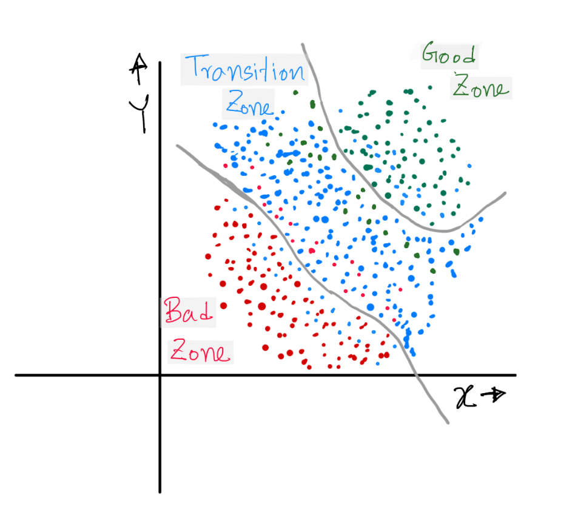

# Usage of Auto Encoder

I was given a dataset of around 130 variables. For every data I had 3 possible outputs:
- Good zone
- Transition zone
- Bad zone
I built an Auto Encoder to find out the working state of the system and find the hypothetical line that will separate these 3 zones in the latent space of the Auto Encoder. 

Auto Encoder Structure:

- Encoder:
    - input layer has 130 neurons.
    - Every layer has less number of neurons than the previous layer.
    - Final output has only 2 neurons
- Decoder:
    - input layer has 2 neurons ( the output of the encoder ).
    - Every layer has more number of neurons than the previous layer.
    - Final output has only 130 neurons ( same as encoder input )
- Latent Space ( 2 neurons )
    - This is the most important part of this project. I intentionally kept here 2 neurons so that I can plot every data point in a 2D graph. Have a look at the graph: 
    
    - *Green points on the graph corresponds to Good zone, blue points corresponds to Transition zone and red points corresponds to Bad zone.*

The auto encoder was trained such a way so that similar encoded output are placed in almost same place in the latent space graph.
The two ash color line is completely hypothetical. They are drawn to divide the zone into 3 parts according to the output. You can see the lines are not perfect either. It was actually kind of impossible to cluster all the similar output in the same place of the latent space. So obviously there was some outliers. But the number of outliers was very insignificant compared to total number of data.

### How it works (when it's already trained):
- A 130 Dimensional data is fed to the encoder.
- Encoder output is only a 2D dimensional data. Say they are are x and y.
- We plot the data on the latent space ( where hypothetical ash color divider was already drawn ).
- Decision:
    - If x,y value falls in the good zone no problem.
    - If x,y value falls in the transition zone , keep an eye on the hardware system if it’s moving towards good zone or the bad zone. Change the some hardware parameters accordingly.
    - It x,y value falls in the bad zone, take immediate steps to solve the problem.
