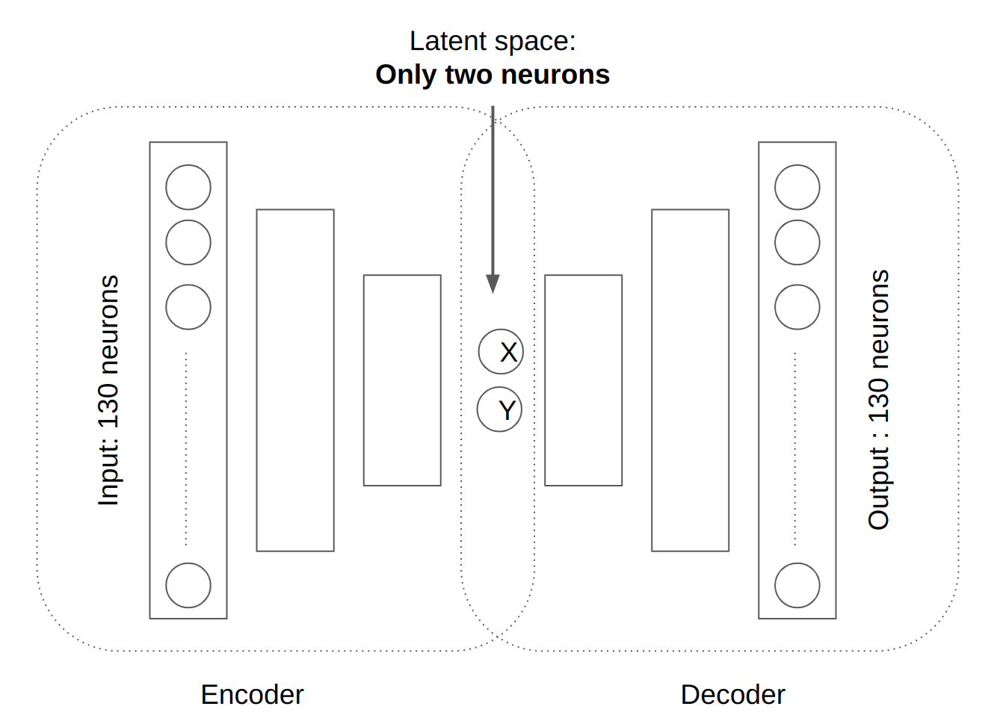

# Usage of Auto Encoder

I was given a dataset of around 130 variables. For every data I had 3 possible outputs:
- Good zone
- Transition zone
- Bad zone
I built an Auto Encoder to find out the working state of the system and find the hypothetical line that will separate these 3 zones in the latent space of the Auto Encoder. 

Auto Encoder Structure:

- Encoder:
    - input layer has 130 neurons.
    - Every layer has less number of neurons than the previous layer.
    - Final output has only 2 neurons
- Decoder:
    - input layer has 2 neurons ( the output of the encoder ).
    - Every layer has more number of neurons than the previous layer.
    - Final output has only 130 neurons ( same as encoder input )