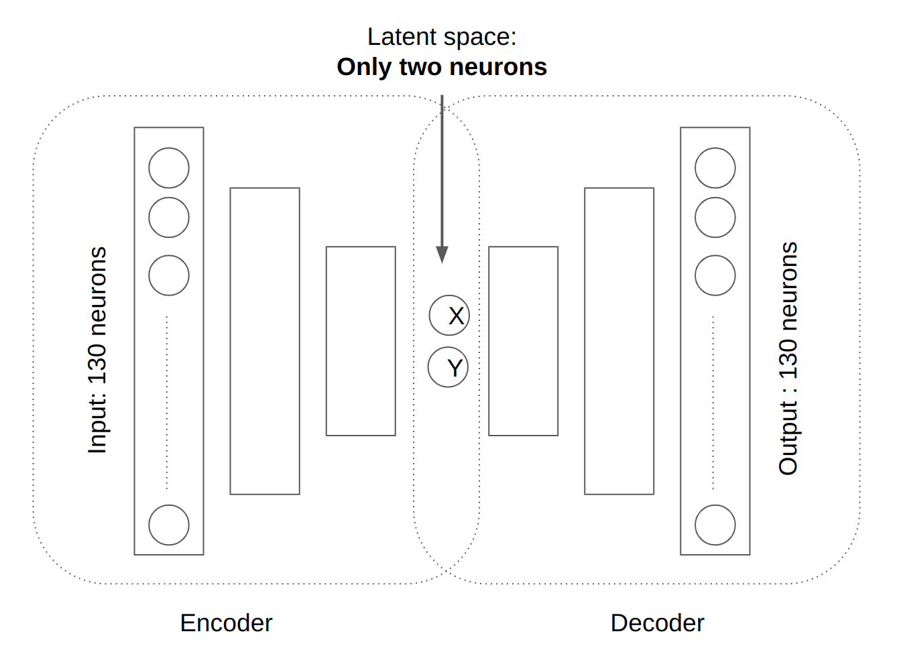
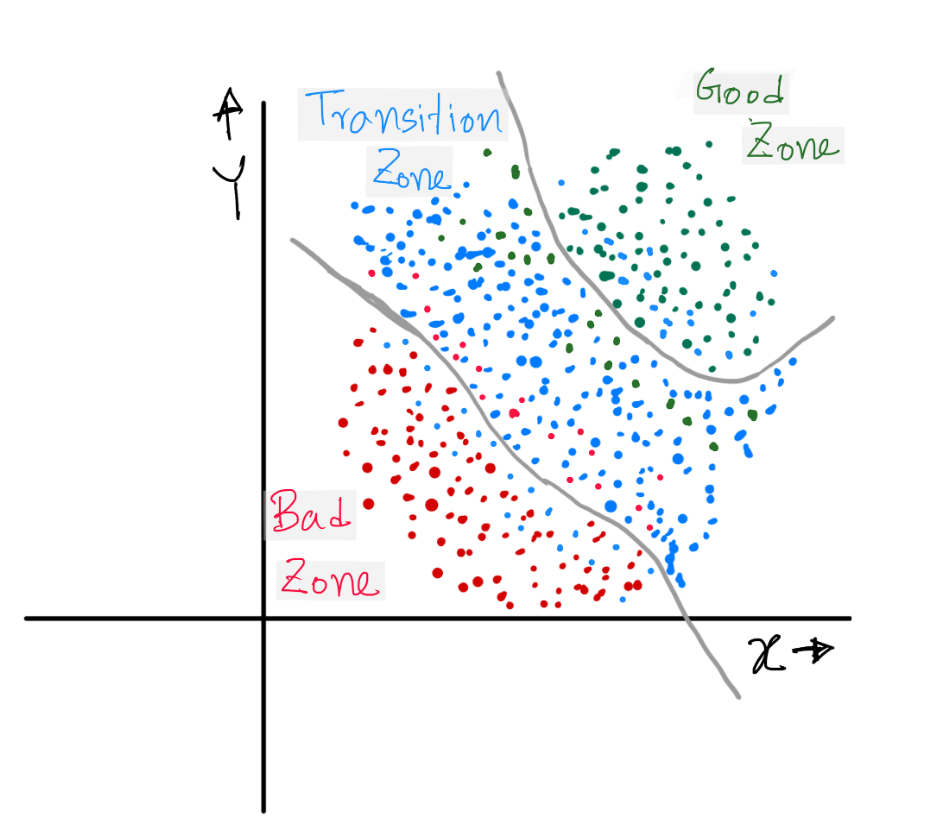

# Usage of Auto Encoder

We were given a dataset of around 130 variables. For every data we had 3 possible outputs:
- Good zone
- Transition zone
- Bad zone
We built an Auto Encoder to find out the working state of the system and to find the hypothetical line that will separate these 3 zones in the latent space of the Auto Encoder. 

## A demo project
*It is crucial to emphasize that due to the non-disclosure agreement (NDA), I am unable to disclose the actual project or its data. The presented project is merely a demonstration, resembling the original one but featuring random images sourced from the internet or created by me.*

Auto Encoder Structure:

- Encoder:
    - The input layer had 130 neurons.
    - Every layer had less number of neurons than the previous layer.
    The final output had only 2 neurons
- Decoder:
    - The input layer had 2 neurons ( the same layer as the output of the encoder ).
    - Every layer had more number of neurons than the previous layer.
    - The Final output had only 130 neurons (the same number as the encoder input )
- Latent Space ( 2 neurons )
    - This was the most important part of this project. We intentionally kept here 2 neurons so that We could plot every data point in a 2D graph. Have a look at the graph: 
      
    - *Green points on the graph correspond to the Good zone, blue points correspond to the Transition zone and red points correspond to the Bad zone.*

The auto-encoder was trained in such a way that similar encoded outputs are placed in almost the same place in the latent space graph.  
The two ash color line is completely hypothetical. They are drawn to divide the zone into 3 parts according to the output. You can see the lines are not perfect either. It was actually kind of impossible to cluster all the similar outputs in the same place of the latent space. So obviously there were some outliers. However, the number of outliers was very insignificant compared to the total number of data.

### How it works (when it's already trained):
- a 130-dimensional data was fed to the encoder.
- Encoder output was only a 2-dimensional data. Say they are are x and y.
- We plot the data on the latent space ( where hypothetical ash color dividers were already drawn ).
- Decision:
    - If the x,y value falls in the good zone no problem.
    - If the x,y value falls in the transition zone, keep an eye on the hardware system to see if it’s moving towards the good zone or towards the bad zone. Change some hardware parameters accordingly.
    - If the x,y value falls in the bad zone, take immediate steps to solve the problem.
