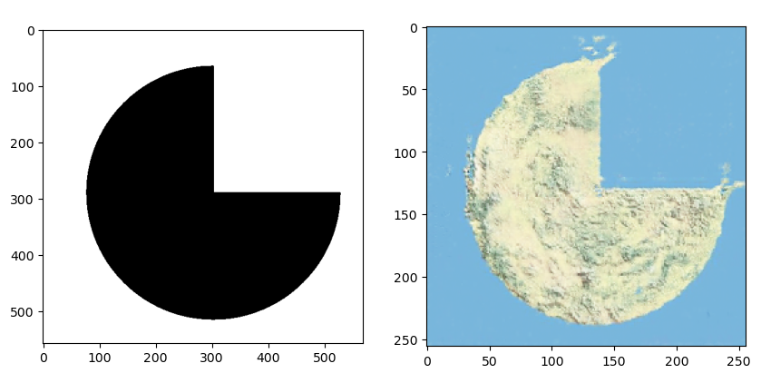
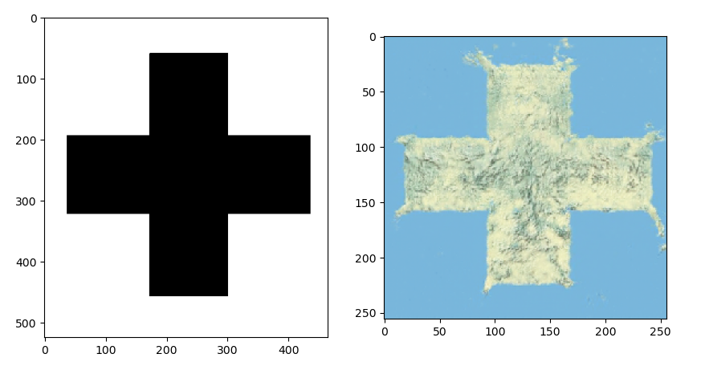
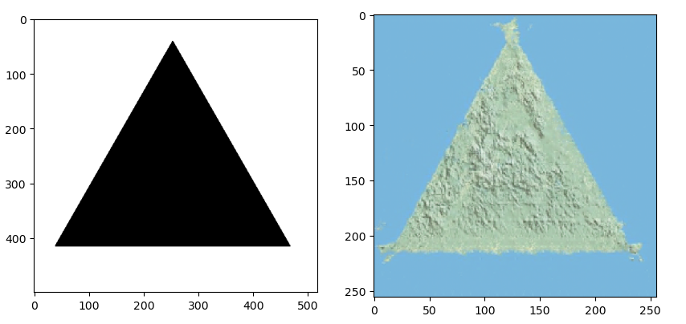
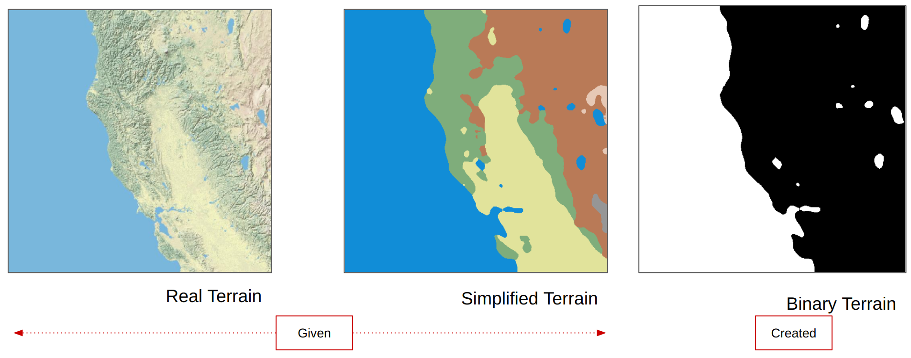
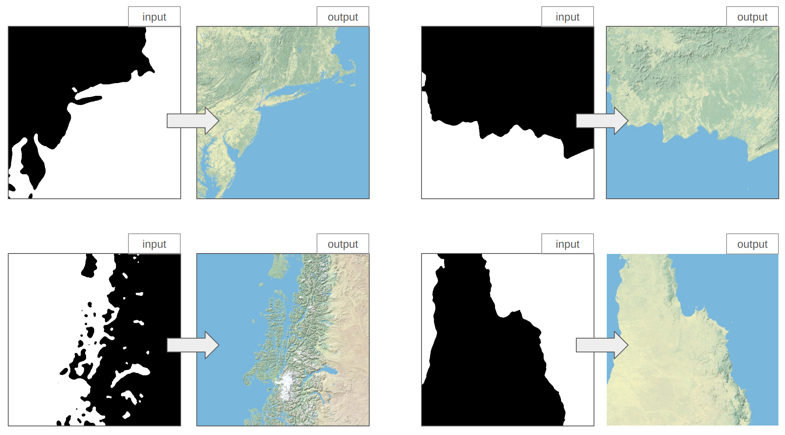

# Pix2Pix GAN
Pix2Pix GAN is based on the conditional generative adversarial network, where a target image is generated, conditional on a given input image. In lots of cases pix2pix GANs are used. We used it on an image to image translation case where we created fake terrains from binary images. Here, I will show you a demo  about that project.

## A demo Project
it's important to note that for NDA, I can not share actual project or actual project data. This is just a demo project similar to the original one with some random images from the internet.

### Data 
Before describing any further procedures, let's have a look at these three images:

For all these 3 images, left side binary image was the input and right side fake terrain was the output. So the inputs and outputs of the project is very clear. 
- Input: a binary image was the input. The black part of that image was converted into land and the white part was converted into water.
- Output: Fake terrain image of the same size was our output. 

#### train data preparation:
This part was tricky. Let's have a look at this image:

- Real Terrain and Simplified Terrain were given.
- We had to create Binary Terrain. It was very easy actually. Where there is no blue, it will be black. Where there is blue, it will be white.
- If we remember our above section `Data`, we know that our input is just a binary image similar to our binary terrain. Because of our specific input criteria, binary terrain had to be created. 
- So after modifying the images, Train input output pair looked like this:

- Which is actually similar to expected input output pairs from `Data` section. That means, Now we are ready to train.

### Pix2Pix GAN structure:

