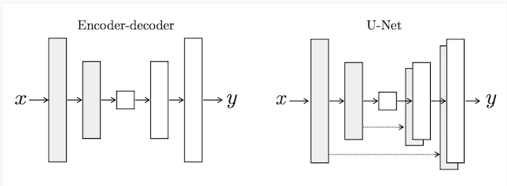
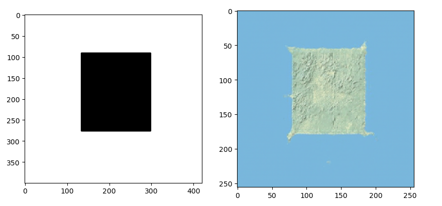
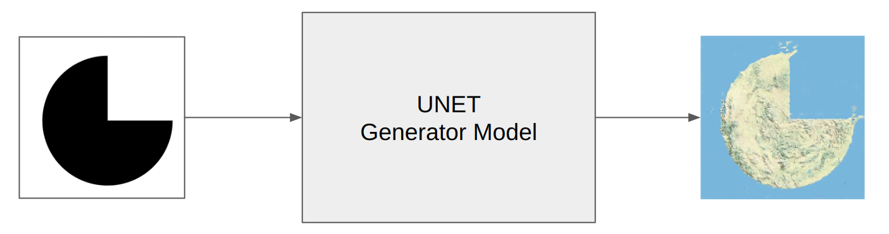
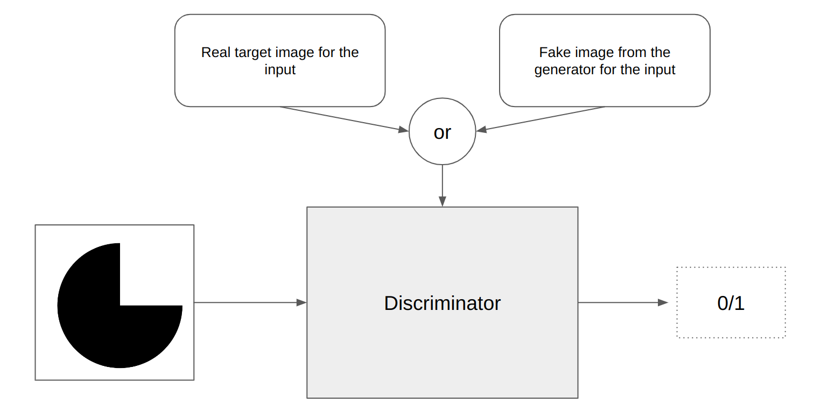
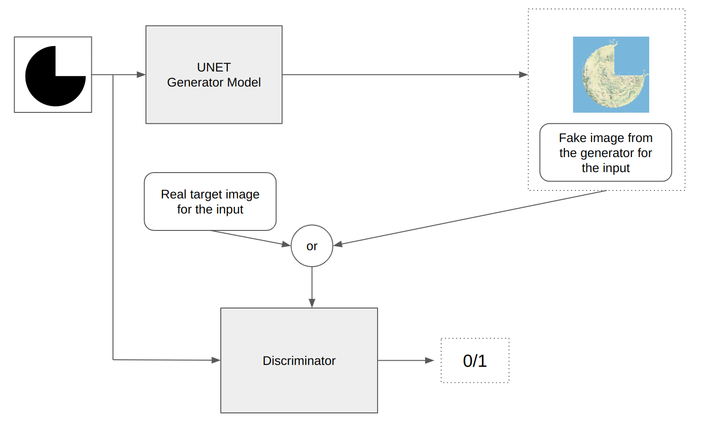

# Pix2Pix GAN
Pix2Pix GAN is based on the conditional generative adversarial network, where a target image is generated, conditional on a given input image. In lots of cases pix2pix GANs are used. We used it on an image to image translation case where we created fake terrains from binary images. Here, I will show you a demo  about that project.

## A demo Project
it's important to note that for NDA, I can not share actual project or actual project data. This is just a demo project similar to the original one with some random images from the internet.

### Data 
Before describing any further procedures, let's have a look at these three images:

For all these 3 images, left side binary image was the input and right side fake terrain was the output. So the inputs and outputs of the project is very clear. 
- Input: a binary image was the input. The black part of that image was converted into land and the white part was converted into water.
- Output: Fake terrain image of the same size was our output. 

#### train data preparation:
This part was tricky. Let's have a look at this image:

- Real Terrain and Simplified Terrain were given.
- We had to create Binary Terrain. It was very easy actually. Where there is no blue, it will be black. Where there is blue, it will be white.
- If we remember our above section `Data`, we know that our input is just a binary image similar to our binary terrain. Because of our specific input criteria, binary terrain had to be created. 
- So after modifying the images, Train input output pair looked like this:

- Which is actually similar to expected input output pairs from `Data` section. That means, Now we are ready to train.

### Pix2Pix GAN structure:
Like other GANs, pix2pix GAN consists of a generator and a discriminator.

#### U-Net Generator Model
 Instead of the common encoder-decoder model, pix2pix gan uses U-Net Architecture for the generator. Unet shape is very similar to encoder-decoder model. It also uses downsampling (in encoder) , bottleneck and upsampling (in decoder). But there are links ( or skip-connections ) between layers of the same size in the encoder and the decoder.
 

 Traditional GANs takes random noise from latent space as input. But in Pix2pix GAN there is nothing like this. Here, the source of randomness comes from the use of dropout layers that are used both during training and when a prediction is made.

**input output of the generator**
- Input: Image from source domain
- Output: Image in target domain

Explanation:
In case of Pix2Pix GAN's generator, input image and the output image are from two different domain. Have a look at the image (This is just similar to above mentioned images):

- left side is the input and the right side is the output. You can clearly see two domains are very different, one is a binary image and another one is a fake terrain.
- UNET (generator) is trained with these pair of images with different domains.

**What is the target?**
A generator has two targets:
1. The output comes from target domain so that discriminator thinks it's not fake.
2. The output becomes the appropriate translation of the the specific input image.

#### PatchGAN Discriminator Model

Let's have a look at the discriminator:

- Input: Image from source domain, and Image from the target domain.  
*Explanation:*  
One of the input is an image from source domain ( which was also the input of the generator). Another input is either a real image from target domain for the specific input image or the Fake image created by the generator for that specific input image.
- Output: Probability that the image from the target domain is a real translation of the source image.  
*Explanation:* 
Discriminator is trained to be able to identify which one is a real image or which one is a fake image  (created by the generator), given that our discriminator knows the input image.

**The name `PatchGAN` discriminator:** 
Unlike the traditional GAN model that uses a deep convolutional neural network to classify images, the Pix2Pix model uses a PatchGAN. This is a deep convolutional neural network designed to classify patches of an input image as real or fake, rather than the entire image.

### Over All structure

- input image (from source domain) goes through the generator.
- generator creates a fake image (from target domain) for that input image 
- same input image is fed to the discriminator. So the discriminator knows which input image we are working with. 
- Either fake image from the generator for that input image or a real target image for that specific input are fed to the discriminator.
- discriminator is trained to be able to identify if it's a fake image or a real image for that specific input.

#### Targets and Losses
- The discriminator target is very straightforward. Conditioned on a specific input image from source domain, it tries to become able to identify if the target domain input is from real images or from fake images. So it's target is minimizing the negative log likelihood of identifying real and fake images, although conditioned on a source image.
- A generator has two targets:
    1. The output comes from target domain so that discriminator thinks it's not fake.
    2. The output becomes the appropriate translation of the the specific input image.
- The generator model is trained using both the adversarial loss for the discriminator model and the L1 or mean absolute pixel difference between the generated translation of the source image and the expected target image. The adversarial loss and the L1 loss are combined into a composite loss function, which is used to update the generator model. 
